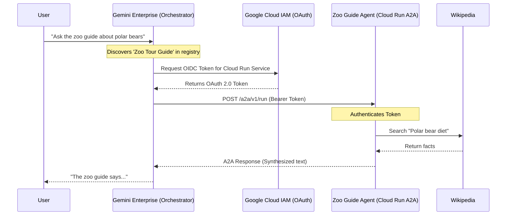

# Zoo Guide Agent - Implementation Specification for A2A and Gemini Enterprise Integration

This specification details the architecture, workflow, and integrations required to add Agent-to-Agent (A2A) capabilities with OAuth 2.0 authentication and integrate the Zoo Guide Agent into Gemini Enterprise.

## 1. Architecture Overview

The Zoo Guide Agent is an AI-powered tour guide built using Google's Agent Development Kit (ADK) and deployed on Cloud Run.

### Current State
- **Core Framework**: Google ADK (Agent Development Kit).
- **Deployment**: Google Cloud Run (Serverless container).
- **Agents**:
  - `greeter` (Root Agent): Welcomes users and captures state.
  - `comprehensive_researcher` (Sub-agent): Uses Wikipedia tools.
  - `response_formatter` (Sub-agent): Synthesizes research into a final response.
- **Authentication**: Unauthenticated (Publicly accessible for dev/testing).

### Target State (with A2A & Gemini Enterprise)
The target architecture introduces an A2A endpoint to allow the agent to act as a tool for other agents, secured by OAuth 2.0, and registered within Gemini Enterprise for discovery and orchestration.

- **A2A Endpoint**: Exposes the agent's capabilities programmatically via the Agent-to-Agent protocol (`/a2a/*`).
- **Authentication (OAuth 2.0)**: Secures the A2A endpoint. Callers (like Gemini Enterprise) must provide a valid OAuth 2.0 access token (Identity Aware Proxy or Service Account OIDC token).
- **Gemini Enterprise Integration**: Registers the agent's "Agent Card" (`/.well-known/agent-card.json`) into the Gemini Enterprise registry, allowing it to be discovered and invoked by enterprise orchestrators.

---

## 2. Implementation Steps

### Phase 1: Enable A2A Protocol in ADK Code

To support A2A, the ADK application needs to serve the A2A endpoints and expose its tool schema.

1.  **Code Changes (`agent.py`)**: Ensure the agent definition has a clear, detailed `description` and `instruction`. The `description` is critical as it becomes the tool description when used via A2A.
    *(No major code changes are strictly required in `agent.py` as ADK CLI handles A2A wrapping at deployment, but descriptions should be refined for A2A context).*

### Phase 2: Deploy to Cloud Run with A2A Enabled and OAuth 2.0 Secured

We must redeploy the service, explicitly enabling A2A and removing the `--allow-unauthenticated` flag to enforce IAM/OAuth authentication.

**Deployment Command:**
```bash
uvx --from google-adk adk deploy cloud_run \
  --project=$PROJECT_ID \
  --region=europe-west1 \
  --service_name=zoo-tour-guide \
  --with_ui \
  --a2a \  # ENABLES THE A2A ENDPOINT
  . \
  -- \
  --service-account="lab2-cr-service@${PROJECT_ID}.iam.gserviceaccount.com" \
  --memory=512Mi \
  --cpu=1 \
  --min-instances=0 \
  --max-instances=1 \
  --no-allow-unauthenticated # ENFORCES AUTHENTICATION
```

### Phase 3: Gemini Enterprise Registration

Once deployed securely with the `--a2a` flag, the service exposes an Agent Card at `https://[SERVICE_URL]/a2a/app/.well-known/agent-card.json`.

We register this with Gemini Enterprise using the `google-adk` publish command (or `agents-cli publish`).

**Prerequisites for Registration:**
1.  **Gemini Enterprise App**: You must have a pre-existing app created in the Google Cloud Console (Gemini Enterprise -> Apps).
2.  **Permissions**: The Discovery Engine service account (`service-<PROJECT_NUMBER>@gcp-sa-discoveryengine.iam.gserviceaccount.com`) must have the `roles/run.servicesInvoker` role on the Cloud Run service to invoke it via A2A.

**IAM Binding for Discovery Engine:**
```bash
gcloud run services add-iam-policy-binding zoo-tour-guide \
  --region=europe-west1 \
  --project=$PROJECT_ID \
  --member="serviceAccount:service-${PROJECT_NUMBER}@gcp-sa-discoveryengine.iam.gserviceaccount.com" \
  --role="roles/run.invoker"
```

**Registration Command:**
```bash
uvx --from google-adk adk publish gemini-enterprise \
  --registration-type a2a \
  --agent-card-url https://zoo-tour-guide-mhdljtwzyq-ew.a.run.app/a2a/app/.well-known/agent-card.json \
  --gemini-enterprise-app-id "projects/${PROJECT_NUMBER}/locations/global/collections/default_collection/engines/zoo-enterprise-app" \
  --display-name "Zoo Tour Guide A2A" \
  --description "Answers questions about zoo animals using Wikipedia." \
  --project-id $PROJECT_ID
```

---

## 3. Workflow Diagram (A2A Invocation)



---

## 4. API & Integration Details

### The A2A API (Exposed by Cloud Run)
When `--a2a` is enabled, the ADK server exposes standard endpoints complying with the A2A spec:
- **Agent Card**: `GET /a2a/app/.well-known/agent-card.json` (Describes the agent, its input schema, and capabilities).
- **Run Endpoint**: `POST /a2a/v1/run` (Accepts standard A2A request payloads and returns A2A responses).

### Authentication Flow (OAuth 2.0 / OIDC)
Because the Cloud Run service is no longer `--allow-unauthenticated`, any caller must provide an `Authorization: Bearer <TOKEN>` header.
- **For Local Testing**: You can obtain a token via `gcloud auth print-identity-token`.
- **For Gemini Enterprise**: Gemini Enterprise uses its managed service account (Discovery Engine) to automatically fetch an OIDC token minted for the target Cloud Run service audience and attaches it to the A2A requests.

### Business Value for Stakeholders
- **Reusability**: By wrapping the Zoo Guide in the A2A protocol, it transforms from an isolated chat application into a reusable enterprise tool.
- **Security**: Transitioning from public access to OAuth-secured A2A ensures that only authorized enterprise applications (like Gemini Enterprise) can incur compute and LLM costs.
- **Composability**: Gemini Enterprise can now route specific zoological queries to this expert agent, while handling general queries itself or routing them to other A2A agents (e.g., a "Ticketing Agent").
